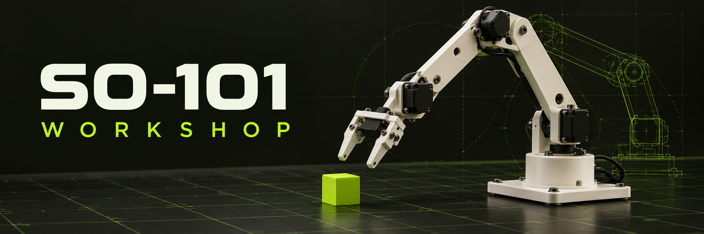

# SO-101 Workshop

**Meet your robot. Before its first move.**

A hands-on robotics workshop that takes you from your first joint and physics experiment to datasets, learned policies, and the SO-101 robot arm. Start on your computer, then follow the hardware and teleoperation guides when your robot arrives.

The repository includes a MkDocs Material guide, an interactive browser lab, runnable MuJoCo scenes, and 17 Python examples covering simulation, LeRobot data workflows, behavior cloning, ACT, and SmolVLA training preparation.

[Start from zero](docs/basla/sifirdan.en.md) · [Learning route](docs/basla/rota.en.md) · [Installation](docs/basla/kurulum.en.md) · [Validation record](docs/basla/dogrulama.en.md)

## What you can do

| Explore | Build and learn |
| --- | --- |
| Robotics fundamentals | Observations, actions, joints, coordinate frames, forward/inverse kinematics, and camera geometry |
| Browser lab | Move a two-link arm and explore dataset size, action timing, and learning checkpoints |
| MuJoCo playground | Drop, slide, push, servo tracking, and seeded scene variation; save trajectories, metrics, RGB, and depth |
| SO-101 simulation | Load the robot through Strands Robots, render camera views, and track waypoints using measured joint state |
| First learned policy | Generate demonstrations, train a small CPU neural network, and evaluate it in fresh physics rollouts |
| LeRobot datasets | Record simulation images/actions, convert numeric demonstrations, inspect episodes, and read action windows |
| Hugging Face Hub | Inspect dataset metadata and sizes, then download a revision-pinned snapshot with an explicit size limit |
| Hardware and VLA | Follow calibration, teleoperation, data collection, ACT/SmolVLA fine-tuning, and evaluation guides |

All **43 chapters** are available in **Turkish and English**, with a neon-green theme, localized navigation/search, 22 practical labs and 16 worked questions. The language switch preserves the current article and browser progress. Some legacy command-line messages remain Turkish. Start at [Türkçe](docs/index.md) or [English](docs/index.en.md).

## Quick start

Use **Python 3.12**, `uv`, and a macOS or Linux shell. Run the commands from the repository root.

```bash
git clone https://github.com/fport/robots-101.git
cd robots-101

uv venv --python 3.12 .venv
uv pip install --python .venv/bin/python -r requirements-docs.txt -r requirements-sim.txt

make doctor
make serve
```

Open **http://127.0.0.1:8000** for Turkish or **http://127.0.0.1:8000/en/** for English. Keep that terminal running and open another for the examples. For documentation only, install `requirements-docs.txt` without `requirements-sim.txt`.

Primary dependencies are pinned in the requirements files: **MuJoCo 3.12.0**, **Strands Robots 0.5.1**, and, in the separate ML environment, **LeRobot 0.6.1**. The `constraints-*.txt` files capture the original macOS dependency snapshots.

## Run your first simulation

Start with a cube falling under gravity. This runs without a graphics window, robot asset download, or ML environment:

```bash
.venv/bin/python examples/13_mujoco_playground.py \
  --scene drop --output outputs/first-drop
```

Inspect `outputs/first-drop/metrics.json` and `trajectory.csv`. Change one setting and compare the result:

```bash
.venv/bin/python examples/13_mujoco_playground.py \
  --scene drop --gravity 0 --output outputs/zero-gravity
```

The scene lives in [models/playground.xml](models/playground.xml). Available modes are `drop`, `slide`, `servo`, `push`, and `random`. Add `--render` to save `rgb.png` and metric depth in `depth_m.npy`; rendering needs a working graphics context.

For a live viewer on macOS:

```bash
.venv/bin/mjpython examples/13_mujoco_playground.py \
  --scene servo --viewer --output outputs/servo-viewer
```

On a Linux desktop, use `.venv/bin/python` with the same arguments. Choose a fresh output directory when repeating playground or learning experiments; these scripts refuse to overwrite existing runs.

Continue with [simulation from scratch](docs/simulasyon/sifirdan.en.md) and [ten experiments](docs/simulasyon/deneyler.en.md).

### Load the SO-101

```bash
make physics
make sim
.venv/bin/python examples/09_so101_waypoints.py
```

`make physics` runs a one-joint tracking exercise. `make sim` downloads the SO-101 assets on first use, runs a mock rollout, and saves `outputs/so101_before.png` and `outputs/so101_after.png`. The waypoint example tracks three joint-space targets and records measured errors. Asset caches live under `.cache/`.

Read [Strands with SO-101](docs/simulasyon/strands.en.md) and [measured-state control](docs/simulasyon/denetleyici.en.md) for the control loop and completion criteria.

## Train your first policy

Create a separate environment for PyTorch and LeRobot:

```bash
uv venv --python 3.12 .venv-ml
uv pip install --python .venv-ml/bin/python -r requirements-ml.txt

.venv-ml/bin/python examples/15_first_learning.py \
  --output outputs/first-learning
```

This CPU experiment generates **40 episodes / 4,000 records** from a handwritten teacher, splits whole episodes into training/validation/test sets, and trains a small network to move one simulated hinge toward a requested angle. It then compares the learned policy with a hold-start baseline in fresh MuJoCo rollouts.

The output includes `demonstrations.csv`, `training_arrays.npz`, `loss.csv`, `policy.pt`, and `metrics.json`. No pretrained model download is needed. Follow [the first learning loop](docs/ogrenme/ilk-ogrenme.en.md) to understand each step.

Convert those demonstrations into a numeric LeRobot dataset:

```bash
.venv-ml/bin/python examples/16_create_lerobot_dataset.py \
  outputs/first-learning/demonstrations.csv --root data/teaching-hinge
.venv-ml/bin/python examples/04_inspect_dataset.py \
  data/teaching-hinge --expected-episodes 40
```

This dataset contains hinge state, goal, and action values. For visual SO-101 data, use the recording workflow below. See [data production](docs/ogrenme/veri-uretimi.en.md) for the differences between numeric, simulated, and physical demonstrations.

## Work with robot datasets

### Record and inspect a simulation dataset

```bash
.venv-ml/bin/python examples/03_record_sim.py --root data/first-smoke
.venv-ml/bin/python examples/04_inspect_dataset.py \
  data/first-smoke --expected-episodes 3
.venv-ml/bin/python examples/08_read_dataset.py \
  --root data/first-smoke --repo-id local/sim-smoke
.venv-ml/bin/python examples/10_action_windows.py \
  data/first-smoke --verify-lerobot
```

The default recording contains three episodes of 30 frames. Recording needs graphics access; the reader decodes camera frames and saves PNG samples. The action-window example checks episode boundaries and compares padding masks with LeRobot's reader.

### Inspect a Hub dataset before downloading it

```bash
.venv-ml/bin/python examples/14_hub_dataset.py lerobot/svla_so100_pickplace
```

The default mode fetches the file listing and small metadata, then reports the resolved revision, size, and dataset schema. Use `--mode metadata` for a preview or `--mode download` with `--revision`, `--root`, and `--max-mb` for a bounded snapshot download. The example repository contains SO-100 data; check robot type, action units, and cameras before using any dataset with your arm.

Follow the [Hugging Face walkthrough](docs/ogrenme/huggingface.en.md) for complete commands. For ACT and SmolVLA, [05_prepare_training.py](examples/05_prepare_training.py) validates dataset metadata and generates a training command. Read the [training guide](docs/ogrenme/smolvla.en.md) and [compute setup](docs/ogrenme/hesaplama.en.md) before starting a larger run.

## Example map

| Scripts | Purpose | Environment |
| --- | --- | --- |
| [00](examples/00_doctor.py) | Report Python, packages, and available accelerators | Either |
| [01](examples/01_mujoco_basics.py), [02](examples/02_strands_so101.py), [09](examples/09_so101_waypoints.py) | Basic physics, SO-101 rendering, and waypoint tracking | `.venv` |
| [03](examples/03_record_sim.py), [04](examples/04_inspect_dataset.py), [08](examples/08_read_dataset.py), [10](examples/10_action_windows.py) | Record, validate, decode, and window robot data | `.venv-ml` |
| [05](examples/05_prepare_training.py), [06](examples/06_evaluate_results.py) | Generate training commands and summarize evaluation CSVs | `.venv` or `.venv-ml` |
| [07](examples/07_toy_behavior_cloning.py), [11](examples/11_flow_matching.py), [12](examples/12_planar_ik.py) | NumPy behavior cloning, flow-matching arithmetic, and planar IK | `.venv` |
| [13](examples/13_mujoco_playground.py) | Configurable MuJoCo playground | `.venv` |
| [14](examples/14_hub_dataset.py) | Inspect and download Hub datasets | `.venv-ml` |
| [15](examples/15_first_learning.py), [16](examples/16_create_lerobot_dataset.py) | Train a CPU hinge policy and export demonstrations to LeRobot | `.venv-ml` |

## Repository layout

The guide includes **12 Mermaid diagrams** across six topics in both languages: the observation/action loop, software data flow, grasp stages, waypoint transitions, SmolVLA internals and the first learning pipeline. They follow the neon-green light/dark theme. The pinned Mermaid 11.17.2 bundle and its license live in `docs/assets/vendor/`, so diagrams render without an external CDN request. Wide diagrams keep readable text and scroll inside their own container on mobile.

Author a diagram in a fenced `mermaid` block with `flowchart TD`, an `accTitle:` and an `accDescr:`. Add the equivalent diagram to the other language; `scripts/check_content.py` checks diagram coverage and descriptions. `docs/assets/diagrams.js` handles rendering and palette changes.

```text
docs/                  Workshop chapters, English translations, and browser lab
examples/              Python exercises numbered 00–16
models/                Teaching scenes in MuJoCo's MJCF format
templates/             Camera card, experiment notes, and evaluation CSV
tests/                 Data, command, evaluation, and learning-example checks
scripts/check_site.py  Browser checks for the documentation site
requirements-*.txt     Dependencies for docs, simulation, ML, and browser checks
constraints-*.txt      Machine-specific dependency snapshots
```

Generated datasets go in `data/`, experiment results in `outputs/`, caches in `.cache/`, and the built documentation in `site/`. These directories are excluded from version control.

## Checks and current scope

```bash
make check
.venv-ml/bin/python -m unittest discover -s tests -v
```

`make check` runs unit tests, verifies complete translation/navigation coverage and documented example flags, then performs a strict bilingual MkDocs build. Run the second command to include tests that require the ML dependencies. Use `make build` for the documentation build alone. Optional browser checks use `scripts/check_site.py`, `requirements-test.txt`, a local Chrome installation, and a running `make serve`.

The browser check renders all 12 Mermaid diagrams with external requests blocked, checks palette changes and mobile keyboard scrolling, and rejects unexpected resource or JavaScript errors. One existing Material 9.7.7 / static-i18n 1.3.1 integration issue is recorded under `known_resource_warnings`: the theme requests `sitemap.xml` below alternate article URLs and receives 404s. The combined sitemap is at the site root; article language switching is checked separately and works.

The [validation record](docs/basla/dogrulama.en.md) documents local Apple Silicon/macOS checks for physics, SO-101 rendering and tracking, LeRobot recording/reading, and the smaller numerical examples. The [first-learning chapter](docs/ogrenme/ilk-ogrenme.en.md) records the CPU hinge experiment separately.

Mock SO-101 recordings exercise the data pipeline; they do not demonstrate successful grasping. The browser arm and hinge-learning example are simplified teaching models. Physical SO-101 operation, full SmolVLA GPU fine-tuning, and learned pick-and-place performance remain unverified here.

## Sources

Primary references are collected in the [source register](docs/kaynaklar.en.md), with links throughout the guide. This is an independent educational workshop; the hardware chapters also reference the supplier's setup instructions.
