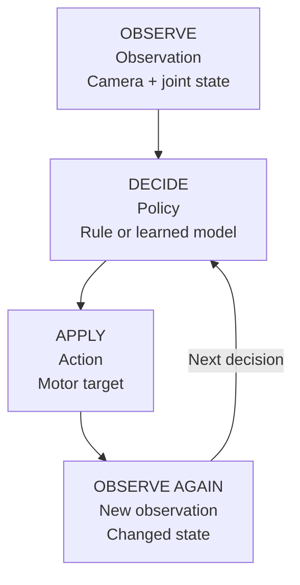

# Completely new to robotics? Start here

You do not need a robotics, mathematics or machine-learning background to begin. Our first goal is to understand where a movement comes from. Turkish pages give English technical terms in parentheses on first use, so you can recognize the same vocabulary in code and external documentation. This English edition follows the same learning path.

## Compare the robot with your own arm

Moving your shoulder and elbow changes where your hand can reach. A robot's rigid pieces are **links**; the moving connections are **joints**. An **actuator**, often a motor and transmission, makes a joint move. The **gripper** at the end tries to hold an object. A closed gripper can still be empty.

The [hardware introduction](../temel/so101.md) describes the SO-101. For now, remember that arm joints and gripper are commanded together, but their numbers do not necessarily represent the same physical quantity.

## What does the robot know?

A camera supplies an image. Motor readings supply joint positions: part of the robot's **state**. Together, the available inputs form an **observation**. An image is a grid of pixels, not an automatic answer saying “the cube is 22 cm from the base.” A method must interpret or use those pixels.

A **policy** selects behavior. It can be a handwritten rule, such as moving toward a target angle in small increments, or a learned model trained on demonstrations. Its command is an **action**.



## Example: put a cube in a tray

This appears to be one task, but involves approaching, descending, closing, lifting, carrying and releasing. Each stage can fail. An invisible cube suggests an observation problem; an unreachable target suggests geometry; an empty closure suggests approach or timing; a dropped object suggests contact or grasp behavior.

One attempt, with a defined start and end, is an **episode**. It contains many image **frames** and action records. A 20-second demonstration at 30 FPS has about 600 time samples, but is still one episode. A frame is not an independent task demonstration.

## What is simulation?

A **simulation** calculates how a computer-defined world changes over time. Its **physics engine** handles movement, gravity and contact. We use MuJoCo. **Rendering** produces a camera image of that world; a window need not be open for physics to run.

You can drop a cube, change friction and repeat a starting condition. This does not automatically create an exact copy of your physical robot. The simulation behaves according to the masses, friction, cameras and actuators defined in its model.

## Why four software packages?

| Software | First role to understand | Analogy |
|---|---|---|
| MuJoCo | Computes the physical world | Experiment table |
| Strands Robots | Provides robot/simulation tools | Toolbox |
| LeRobot | Records, reads and trains on robot data | Notebook and training infrastructure |
| SmolVLA | Predicts actions from images, task text and state | Learned behavior model |

Hugging Face hosts **datasets** and **models**. A dataset contains examples; a model contains learned weights. Downloading data does not train a model. See the [software map](../temel/yigin.md) for primary sources.

## Read a terminal command

```bash
.venv/bin/python examples/13_mujoco_playground.py --scene drop --output outputs/my-drop
```

`.venv/bin/python` is the Python executable. `examples/...py` is the script. `--scene drop` selects an experiment. `--output ...` chooses a results directory. Paste the line into a terminal in the project root, not into a Python file.

A **virtual environment** keeps this project's Python packages together. Using its explicit executable avoids selecting the wrong environment. The [installation page](kurulum.md) shows how to create it.

## Your first three sessions

**Session 1 — meet the concepts:** read this page and move the [browser arm](../temel/laboratuvar.md). Distinguish joint angle from tip position; memorizing formulas can wait.

**Session 2 — run an experiment:** open [simulation from scratch](../simulasyon/sifirdan.md). Drop the cube, then disable gravity. Record what changed and why in two sentences.

**Session 3 — learn from data:** run [your first small learning experiment](../ogrenme/ilk-ogrenme.md). Follow the source of the data, the prediction target and the separate physics test.

Each session has one concrete completion condition. When something fails, identify the stage: executable missing, package missing, model loading failed, or graphics failed. Randomly changing commands makes that harder.

## What can wait?

You do not need ROS 2, inverse kinematics, reinforcement learning or GPU training details to complete your first drop and dataset-reading experiments. We introduce them when a concrete problem needs them.

**Checkpoint:** explain observation → policy → action, distinguish episode from frame, and identify the script in a command. Then continue.
