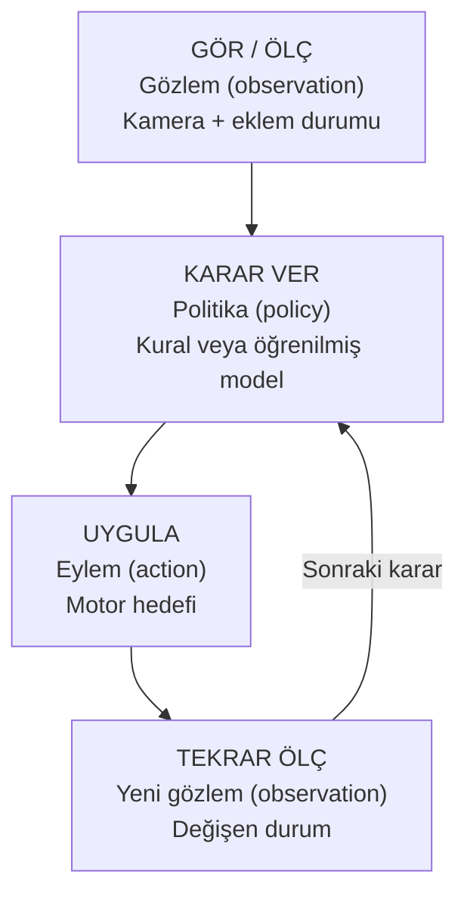

# Robotik hiç bilmiyorum: buradan başla

Bu sayfaya geldiğinde robotik, matematik veya makine öğrenmesi biliyor olmanı beklemiyorum. İlk hedefimiz robotu “zeki” yapmak değil; bir hareketin nereden geldiğini anlamak. Teknik bir sözcük ilk geçtiğinde İngilizcesini parantezde göreceksin: eklem (joint), gözlem (observation) gibi. Aynı sözcüğü kaynak kodunda ve başka eğitimlerde tanıyabilmen için bunu yapıyoruz.

## Robot kolu kendi kolunla düşün

Omzun ve dirseğin hareketi, elinin masanın üzerinde nereye ulaşacağını değiştirir. Robotun sert parçalarına bağlantı (link), hareket edebilen birleşimlerine eklem (joint) deriz. Motor/aktüatör (actuator) eklemi hareket ettirir. Uçtaki tutucu (gripper) nesneyi sıkıştırarak tutmaya çalışır. Tutucunun kapalı olması elinde nesne olduğu anlamına gelmez; boş da kapanabilir.

SO-101'in gövdesini [donanım tanıtımında](../temel/so101.md) göreceksin. Şimdilik şunu bil: kolun eklem hareketleri ve tutucu birlikte komutlanır; her sayı aynı tür fiziksel hareket anlamına gelmez.

## Robot kendi kendine ne bilir?

Bir kamera (camera) ona görüntü verir. Motorlardan okunan eklem konumları, kendi durumunu (state) bildirir. Bu girdilere birlikte gözlem (observation) diyebiliriz. Kamera görüntüsü “küpün robota göre koordinatı 22 cm” diye hazır bir cevap değildir; piksel değerleridir. O bilgiyi kullanacak bir yöntem gerekir.

Robotun davranışını seçen kurala veya modele politika (policy) denir. Çok basit olabilir: “hedef açıya doğru küçük adımlarla ilerle.” Öğrenilmiş de olabilir: geçmiş insan gösterimlerinden yeni gözleme uygun hareket tahmin et. Politikanın seçtiği komuta eylem (action) deriz.



## Bir örnek: küpü kaba koymak

İnsan için tek iş gibi görünür. Robot açısından yaklaşmak, alçalmak, tutucuyu kapatmak, kaldırmak, taşımak ve bırakmak gibi aşamalar içerir. Her aşama başarısız olabilir. Küp görünmüyorsa algılama; kol yetişemiyorsa geometri; tutucu boş kapanıyorsa yaklaşma/zamanlama; taşırken düşüyorsa temas (contact) veya tutuş incelenir.

Bir görev denemesine bölüm (episode) diyeceğiz: belirli bir başlangıç, hareketler ve bir son. O deneme içinde birçok görüntü karesi (frame) ve eylem kaydı vardır. **Bir video karesi bir görev denemesi değildir.** 20 saniyelik 30 FPS bir gösterimde yaklaşık 600 zaman örneği vardır, ama hâlâ tek episode'dur.

## Simülasyon nedir, ne değildir?

Benzetim/simülasyon (simulation), bilgisayarda tanımladığın dünyanın zamanla nasıl değiştiğini hesaplar. Fizik motoru (physics engine) yerçekimi (gravity), hareket ve temas gibi ilişkileri sayısal olarak çözer. MuJoCo burada kullandığımız fizik motorudur. Ekrandaki görüntüyü üretmek ise görselleştirme (rendering) işidir; fizik hesaplanırken pencere açık olmak zorunda değildir.

Simülasyonda küpü düşürebilir, sürtünmeyi değiştirebilir ve aynı başlangıcı tekrar kurabilirsin. Bu, gerçek kolunun otomatik olarak birebir kopyasını elde ettiğin anlamına gelmez. Kütle (mass), sürtünme (friction), kamera ve motor davranışı modelde ne tanımlandıysa odur.

## Dört yazılımı neden kullanıyoruz?

| Yazılım | İlk anlayacağın görevi | Benzetme |
|---|---|---|
| MuJoCo | Fizik dünyasını hesaplar | Deney masası |
| Strands Robots | Robot/sim araçlarına ortak erişim sağlar | Masadaki araç kutusu |
| LeRobot | Robot verisini kaydeder, okur ve öğrenme hattını kurar | Defter ve eğitim (training) düzeni |
| SmolVLA | Görüntü, görev metni ve durumdan hareket üretir | Eğitilen davranış modeli |

Hugging Face ise veri setleri (datasets) ve modelleri (models) bulabileceğin/paylaşabileceğin bir platformdur. Veri seti (dataset) kayıt örnekleridir; model öğrenilmiş ağırlıklardır. Birini indirmek diğerini eğitmek değildir. [Yazılım haritası](../temel/yigin.md) kaynakları açar.

## Terminal komutunu nasıl okuyacaksın?

Şu örneği parçala:

```bash
.venv/bin/python examples/13_mujoco_playground.py --scene drop --output outputs/my-drop
```

`.venv/bin/python` kullanacağımız Python programıdır. `examples/...py` çalıştırılan dosya. `--scene drop` düşürme deneyini seçer. `--output ...` sonuçların yazılacağı klasördür. Bütün satırı projenin kök klasöründeki terminale yapıştırırsın; Python dosyasının içine yazmazsın.

Sanal ortam (virtual environment), bu proje için kurduğumuz paketlerin ayrı bulunduğu klasördür. İlk başta her komutta açık Python yolunu kullanmak, yanlış ortamı seçme ihtimalini azaltır. [Kurulum sayfası](kurulum.md) ortamın nasıl oluşturulacağını gösterir.

## İlk üç oturum

**Oturum 1 — tanış:** bu sayfayı oku, [tarayıcı kolunu](../temel/laboratuvar.md) oynat, eklem açısı ile uç konumunu ayırt et. Formülü ezberlemek gerekmiyor.

**Oturum 2 — deney yap:** [sıfırdan simülasyon](../simulasyon/sifirdan.md) bölümünü aç. Küpü düşür; yerçekimini sıfırla. Sayısal sonuç değişiyor mu? Gördüğünü iki cümleyle yaz.

**Oturum 3 — veriden öğrenme:** [ilk küçük öğrenme deneyini](../ogrenme/ilk-ogrenme.md) çalıştır. Verinin nereden geldiğini, modelin ne tahmin ettiğini ve yeni başlangıçlarda nasıl denendiğini izle.

Her oturumda tek bir başarı koşulu var. Bir hata aldığında kopyala-yapıştır komutları rastgele değiştirme; hangi aşamanın başarısız olduğunu bul: program bulunamadı mı, paket mi eksik, sahne mi yüklenmedi, görüntü mü açılamadı?

## Şimdilik öğrenmek zorunda olmadıkların

İlk küp düşürme ve veri okuma deneyi için ROS 2, ters kinematik (inverse kinematics), pekiştirmeli öğrenme (reinforcement learning) veya GPU eğitiminin ayrıntılarını bitirmene gerek yok. Bunları ileride gerçek ihtiyacınla ilişkilendireceğiz. “Bunu henüz bilmiyorum” demek yanlış yolda olduğun anlamına gelmez.

**Kendini kontrol et:** “gözlem → politika → eylem” zincirini kendi kelimelerinle anlatabiliyor, episode ile frame'i ayırabiliyor ve komutun hangi dosyayı çalıştırdığını gösterebiliyorsan devam et.
