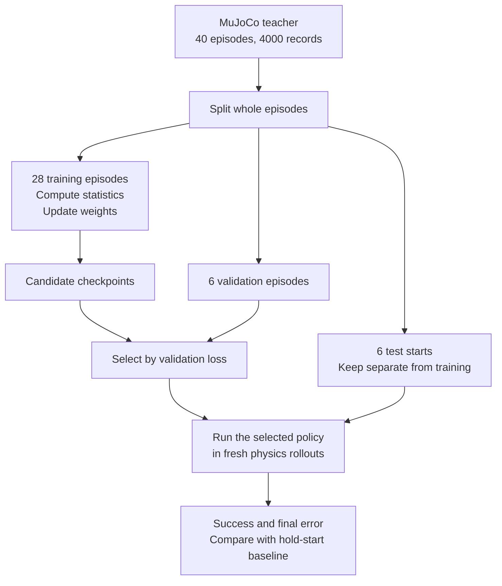

# From data to your first learned policy

This is a small, working answer to “how does a robot learn from data?” A single MuJoCo hinge learns to reach a requested angle through a small neural network. There are no images, language inputs or SmolVLA weights: the reduced problem makes each component visible.

## How data, training and testing connect



## 1. The teacher demonstrates

For current angle `q` and goal `g`, a handwritten expert chooses:

```text
action = q + clip(g - q, -0.06, +0.06)
```

A distant goal produces a target at most 0.06 rad away. That is a command, not a guarantee that the physical joint moves 0.06 rad in one step. Each decision advances ten 0.002 s physics steps, giving 50 Hz control.

Forty starting/goal pairs are sampled, with 100 decisions each: 4,000 records. The source of the correct label is this explicit teacher rule.

## 2. What does the student see?

Input is two numbers, current angle and goal. Output is one absolute motor target. During learned rollouts the student does not call the teacher; it predicts from the examples it learned. It reads a fresh joint angle every decision, forming a closed loop.

Without the goal input, the same joint position cannot specify which direction is desired. A larger network cannot recover information omitted from the observation.

## 3. Split before training

The first 28 episodes are training, the next six validation, and the final six test. Adjacent frames are not randomly split across these sets. Input mean and standard deviation are computed from training records only.

Validation loss selects the checkpoint. Test starts are not used for that choice. Finally, new MuJoCo rollouts run from those test starts, rather than merely comparing predictions with saved labels.

## 4. How does the network calculate?

The architecture is `2 → 32 → 32 → 1`: two inputs, two hidden layers of width 32, one output. Learned coefficients are weights, initially randomized.

Each mini-batch has 128 records. The network predicts actions and mean squared error compares them with teacher actions. For one scalar prediction 0.3 and target 0.5, squared error is 0.04. This is a numerical prediction error, not a grasp score.

## 5. One learning update

```python
prediction = policy(observation_batch)
loss = mse(prediction, teacher_action_batch)
optimizer.zero_grad()
loss.backward()
optimizer.step()
```

The forward pass predicts. Backpropagation calculates gradients describing how weights affect error. The optimizer, Adam in this example, updates weights. `optimizer.step()` changes network parameters; a separate MuJoCo loop moves the simulated joint.

Training performs 1,500 updates. Validation is measured every 100 updates; the best validation checkpoint is retained. The final update is not assumed to be the best.

## 6. Run it and inspect the files

```bash
.venv-ml/bin/python examples/15_first_learning.py --output outputs/my-learning
```

| File | Contents |
|---|---|
| `demonstrations.csv` | Teacher records and episode splits |
| `training_arrays.npz` | Inputs, labels, masks and normalization statistics |
| `loss.csv` | Training/validation progression |
| `policy.pt` | Selected weights, architecture and normalization |
| `metrics.json` | Fresh physics rollouts and baseline comparison |

This uses CPU PyTorch and MuJoCo in the ML environment. It does not download model weights or launch a paid GPU job. To create a standard LeRobot dataset from the numeric CSV, use the [converter](veri-uretimi.md).

## 7. Evaluate inside physics

The six held-out starting conditions are reset in MuJoCo. The student controls each for 100 decisions. A **hold-start baseline** runs under the same conditions. Success requires final angle error below 0.04 rad.

The local seed=42, 1,500-update run achieved **6/6** for the learned policy and **0/6** for hold-start. Mean final errors were approximately **0.01848 rad** and **0.61127 rad**, respectively. These are six simple hinge trials, not broad robotics, SO-101 or VLA performance.

The teacher already solves this task. Training is useful here to expose the data → learning → independent physics test sequence, not to claim a discovery better than the teacher.

## 8. Change the training budget

```bash
.venv-ml/bin/python examples/15_first_learning.py --steps 100 --output outputs/my-learning-short
```

Compare validation error, then rollout outcomes. More updates need not improve every seed or task monotonically. Repeat with another seed before treating one run as universal evidence.

## 9. Map this to SmolVLA

| Small experiment | SmolVLA workflow |
|---|---|
| Two-number observation | Cameras, robot state and task text |
| One motor target | SO-101 actions and future action chunks |
| Handwritten teacher | High-quality human/simulation experts |
| Tiny MLP with MSE | Pretrained model, action expert and flow matching |
| Short CPU run | Fine-tuning with memory/decoder/compute requirements |
| Six physics trials | Predefined independent task evaluations |

The structure remains: prepare examples, split, predict, measure error, update weights, evaluate behavior independently. The tensors and learning objective become more complex. Continue with [SmolVLA internals](smolvla-ic-yapi.md) and the [training recipe](smolvla.md).

**Checkpoint:** explain the separate roles of `loss.backward`, `mj_step` and `policy(observation)`, and evaluate a saved policy independently from its training records.
