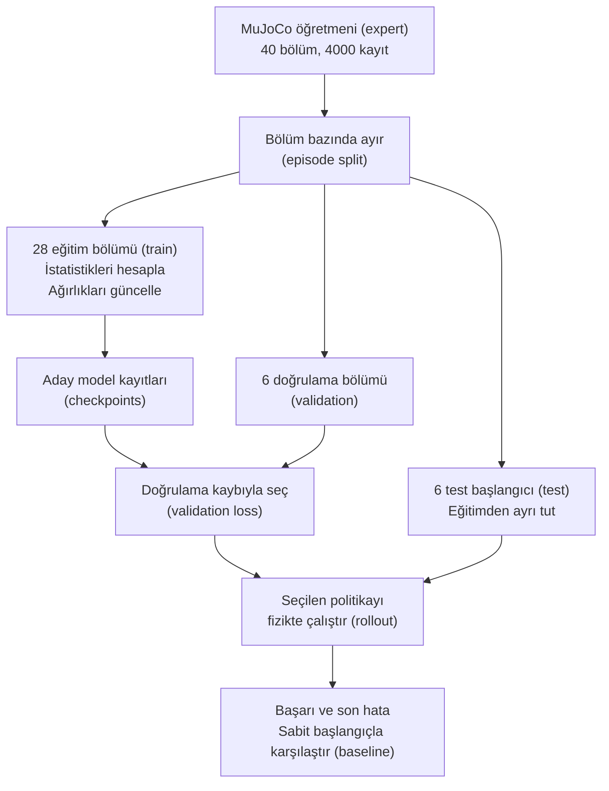

# Veriden öğrenmeye: ilk küçük modelin

“Robot veriyi nasıl öğreniyor?” sorusunu küçük ve gerçekten çalışan bir deneyle açalım. Burada görüntü, dil veya SmolVLA yok: MuJoCo'daki tek eklem (joint), istenen açıya gitmeyi küçük bir sinir ağıyla (neural network) öğrenir. Bu basitlik hangi parçanın ne yaptığını görmeni sağlar.

## Veri, eğitim ve test birbirine nasıl bağlanıyor?



## 1. Öğretmen önce davranışı gösterir

Öğretmen denetleyici (expert controller), mevcut açı `q` ve hedef `g` için yakın bir motor referansı seçer:

```text
action = q + clip(g - q, -0.06, +0.06)
```

Hedef uzaktaysa en çok 0.06 rad ileride bir referans ister. Bu motorun o adımda kesin 0.06 rad hareket edeceği anlamına gelmez; fizik modeli hedefi takip etmeye çalışır. Her kararın ardından 10 fizik adımı ilerler: 10×0.002 s =0.02 s, yani 50 Hz kontrol.

40 farklı başlangıç/hedef çifti örneklenir. Her bölüm (episode) 100 karar içerir; toplam 4000 gösterim (demonstration) satırı. “Doğru etiket nereden geliyor?” sorusunun cevabı bu açık öğretmen kuralıdır.

## 2. Öğrenci ne görüyor?

Giriş (input) iki sayı: mevcut açı ve hedef açı. Çıkış (output) bir sayı: mutlak motor hedefi. Öğrenci öğretmen kodunu çağırmaz; gösterim çiftlerinden buna benzer bir eşleme öğrenir. Her kontrol adımında yeni açı okuyarak kapalı çevrim (closed loop) çalışır.

Hedefi girişten çıkarırsan aynı eklem konumundan hangi yöne gitmek istediğini öğrenci bilemez. Bu, veri tasarımındaki bir eksiktir; daha büyük ağ eklemek kayıp (loss) bilgiyi geri getirmez.

## 3. Bölme eğitimden önce yapılır

İlk 28 episode eğitim (training), sonraki 6 doğrulama (validation), son 6 test içindir. Kareler rastgele karıştırılarak iki tarafa bölünmez. Ortalama ve standart sapma yalnız eğitim örneklerinden hesaplanır.

Doğrulama kaybı (validation loss), hangi ağırlık kaydının (checkpoint) seçileceğine yardım eder. Test başlangıçları bu seçimde kullanılmaz. Sonunda model bu başlangıçlardan yeniden MuJoCo içinde yürütülür; yalnız kaydedilmiş etiketlere bakılmaz.

## 4. Model nasıl hesap yapar?

Ağ yapısı `2 → 32 → 32 → 1`. İlk sayı giriş boyutu, ortadakiler gizli katman (hidden layer) genişlikleri, son sayı çıktı boyutu. Bağlantıların öğrenilen katsayılarına ağırlık (weight) denir. Başlangıçta rastgele değerleri vardır.

Bir mini yığın (mini-batch) 128 örnek içerir. Model eylem (action) tahminlerini üretir; öğretmenin eylemleriyle ortalama karesel hata (mean squared error, MSE) hesaplanır. Tahmin 0.3, hedef 0.5 ise o tek örneğin karesel hatası 0.04'tür. Bu aritmetik mesafedir; nesne kavrama puanı değildir.

## 5. Öğrenme güncellemesi

```python
prediction = policy(observation_batch)
loss = mse(prediction, teacher_action_batch)
optimizer.zero_grad()
loss.backward()
optimizer.step()
```

İleri geçiş (forward pass) tahmin üretir. Geri yayılım (backpropagation) ağırlık değişiminin hatayı nasıl etkilediğini hesaplar. Eniyileyici (optimizer) bu gradyanları (gradients) kullanarak ağırlıkları günceller. Bu script küçük ağ için Adam kullanır. `optimizer.step()` robotu hareket ettirmez; ağın sayılarını değiştirir. Robotu hareket ettiren kısım ayrı MuJoCo döngüsüdür.

1500 güncelleme yapılır. Her 100 güncellemede doğrulama hatası ölçülür; en iyi doğrulama kaybını veren ağırlıklar (weights) saklanır. “En son model kesin en iyi” varsayımı yapılmaz.

## 6. Çalıştır ve dosyaları tanı

```bash
.venv-ml/bin/python examples/15_first_learning.py --output outputs/my-learning
```

| Dosya | Ne içerir? |
|---|---|
| `demonstrations.csv` | Öğretmen örnekleri ve episode bölmeleri |
| `training_arrays.npz` | Giriş/etiket dizileri, maskeler ve ölçek istatistikleri |
| `loss.csv` | Eğitim ve doğrulama hatasının ilerleyişi |
| `policy.pt` | Seçilen ağırlıklar, ağ yapısı ve normalizasyon (normalization) bilgisi |
| `metrics.json` | Simülasyondaki yeni politika yürütümü (rollout) sonuçları ve karşılaştırma |

Script CPU üzerinde çalışır; model ağırlığı indirmez, ücretli GPU işi açmaz. ML ortamındaki PyTorch ve MuJoCo gerekir. Sayısal veriyi LeRobot biçimine çevirmek için [üretim bölümündeki dönüştürücüyü](veri-uretimi.md) kullan.

## 7. Modeli gerçekten simülasyonda dene

Son testte altı yeni episode başlangıcına dönülür. Öğrenci 100 karar boyunca kendi tahminleriyle hareket eder. Karşılaştırma (baseline) olarak “başlangıç açısını tut” davranışı aynı koşullarda çalıştırılır. Başarı: son açı hatası 0.04 rad'den küçük.

Bu makinede rastgelelik tohumu (seed)=42 ve 1500 güncellemede öğrenci **6/6**, başlangıcı tutan baseline **0/6** başarı verdi. Ortalama son hata öğrenci için yaklaşık **0.01848 rad**, baseline için **0.61127 rad** oldu. Bunlar altı basit tek eklem testi içindir; genel robotik başarı, SO-101 veya VLA sonucu değildir.

Öğretmenin kendisi zaten bu görevi çözebilir. Öğrenciyi eğitme amacımız burada öğretmenden daha iyi kontrol keşfetmek değil, veri → öğrenme → bağımsız fizik testi zincirini anlamaktır.

## 8. Bir değişiklik dene

```bash
.venv-ml/bin/python examples/15_first_learning.py --steps 100 --output outputs/my-learning-short
```

Kısa eğitimi ayrı klasörde çalıştır. Önce validation hatasını, sonra fizik testlerini karşılaştır. Daha çok adımın her seed ve görevde monoton iyileşme sağlayacağını varsayma. Yeni seed denemesiyle sonucu tek rastlantıya bağlamamayı öğren.

## 9. Buradan SmolVLA'ya geçiş

| Küçük deney | SmolVLA yolundaki karşılığı |
|---|---|
| İki sayılık gözlem | Kameralar + robot durumu + görev metni |
| Bir motor hedefi | SO-101 eylemleri ve gelecekteki eylem dizisi |
| El yazımı öğretmen | Kaliteli insan/sim uzman gösterimleri |
| Küçük MLP ve MSE | Ön eğitimli model, action expert ve flow matching |
| CPU'da kısa koşu | Bellek/decoder/GPU gerektirebilen ince ayar (fine-tuning) |
| Altı fizik testi | Önceden belirlenmiş ayrı görev denemeleri |

Temel mantık korunur: örnek hazırla, ayır, tahmin et, hatayı ölç, ağırlığı güncelle, bağımsız davranış testi yap. SmolVLA'da tensörler ve öğrenme amacı daha karmaşıktır. [Modelin iç yapısı](smolvla-ic-yapi.md) ve [eğitim tarifi](smolvla.md) artık bu küçük deney üzerine oturur.

**Bitirme ölçütü:** `loss.backward`, `mj_step` ve `policy(observation)` işlemlerinin üç farklı görevi olduğunu anlatabiliyor, kaydedilen modelin başarısını eğitim verisinden ayrı sınayabiliyorsun.
