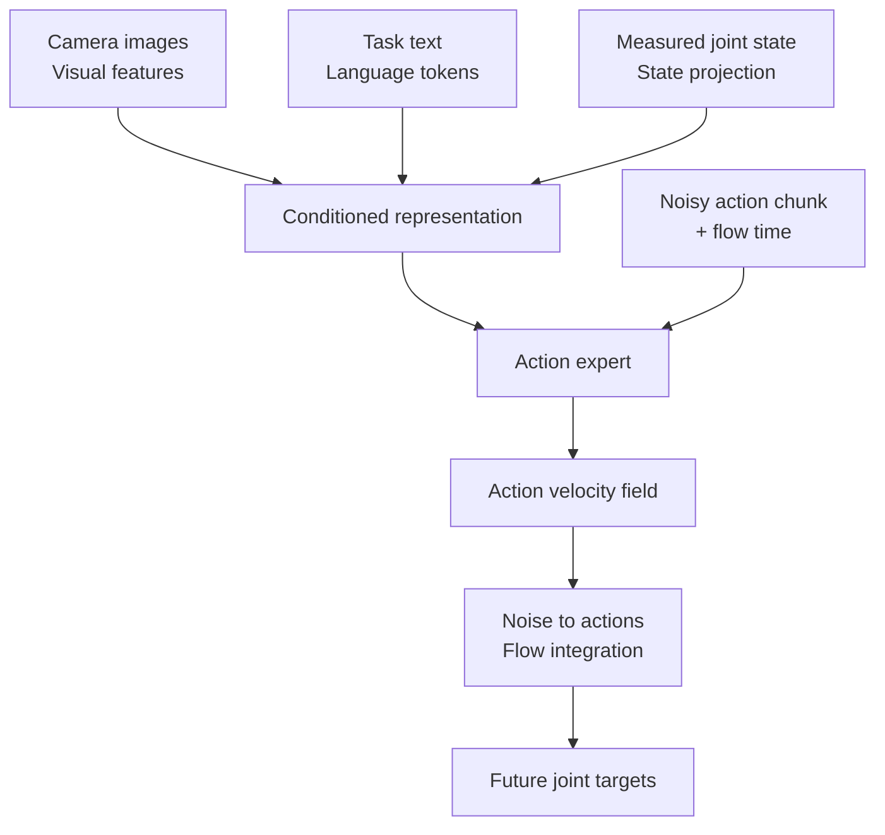

# How SmolVLA learns internally

The [training recipe](smolvla.md) constructs a problem: predict future action sequences from images, task text and measured robot state. This explanation follows installed **LeRobot 0.6.1** and the inspected source revision. A checkpoint can override defaults; its saved configuration defines your actual run.

## 1. Inputs and the action expert



SmolVLA combines visual-language representations with an action expert, action chunks and flow matching. Language conditions the task; the output is not Python code written as a chat reply. “Pick up the red cube” alone does not provide cube coordinates. The model needs images, state and learned relationships. If every episode uses identical text, those data alone do not demonstrate learning to choose between different language instructions. [SmolVLA paper](https://arxiv.org/abs/2506.01844)

## 2. Read the tensor shapes

Take batch `B=8`, two cameras recorded at 480×640, action dimensions `D=6` and horizon `H=50`:

| Stage | Example shape | Meaning |
|---|---|---|
| One camera on disk | `[480,640,3]` | Height, width, channels |
| One camera batch | `[8,3,480,640]` | Batch, channels, height, width |
| State | `[8,6]` | Measured joint/gripper state |
| Action targets | `[8,50,6]` | Fifty future six-dimensional commands |
| Temporal padding mask | `[8,50]` | Labels outside episode boundaries |
| Language tokens | `[8,L]` | Token length, unrelated to action horizon |
| Internal state/action width | Last axis padded to 32 | Common internal representation |

Two cameras normally arrive as separately named features; do not assume an automatic `[B,2,3,H,W]` tensor. Internal image resizing/padding is another operation. Inspected config defaults include a 512×512 target, `max_state_dim=max_action_dim=32`, `chunk_size=n_action_steps=50` and `num_steps=10`. A width of 32 does not give the robot 32 motors. Correct shape also does not prove correct joint order or units. [Configuration source](https://github.com/huggingface/lerobot/blob/2774d9bddcbbda50e697e162e89e7eaada8d7105/src/lerobot/policies/smolvla/configuration_smolvla.py)

## 3. Preprocessing and normalization

State/action statistics put channels on suitable numerical scales. Otherwise a channel with large raw values can dominate squared error. The runtime must preserve the matching preprocessing and inverse action transform.

Images typically arrive from the reader as `[0,1]` floats. The inspected SmolVLA image preparation resizes/pads and maps them to `[-1,1]` for the encoder. Applying the same transform again outside the model corrupts the range. Print feature names, shapes, extrema and finite checks for one batch. RGB versus BGR can pass shape checks, so also inspect a colored object visually. [Model implementation](https://github.com/huggingface/lerobot/blob/2774d9bddcbbda50e697e162e89e7eaada8d7105/src/lerobot/policies/smolvla/modeling_smolvla.py)

## 4. Why a conditional action distribution?

Imagine two valid trajectories passing left and right of an obstacle. Their pointwise mean can pass through it. A conditional generative model aims to represent an action distribution. This motivation does not guarantee every multimodal task will be solved.

Flow matching constructs intermediate points between demonstrated actions and random noise. The model learns a direction/velocity field conditioned on the observation. Here `t` is a **flow interpolation parameter**, not robot seconds or a frame index.

## 5. Keep the sign convention consistent

```text
A = normalized demonstrated action chunk
ε = standard Gaussian noise of the same shape
x_t = (1 - t) A + t ε
u_t = ε - A
```

At `t=0` we have data; at `t=1` we have noise. The model predicts `vθ(x_t,t,conditions)` and is trained against `u_t` with squared error. Other explanations can reverse the time convention; do not copy one sign from another convention in isolation.

Our two-dimensional arithmetic example:

```text
A = [0.2, -0.4]       ε = [1.0, 0.6]       t = 0.75
x_t = [0.8, 0.35]     u_t = [0.8, 1.0]
prediction v = [0.7, 1.2]
MSE = ((0.7-0.8)² + (1.2-1.0)²) / 2 = 0.025
```

These are illustrative normalized values, not physical arm commands.

## 6. Inference moves from noise to actions

Sampling starts at `t=1` and integrates toward `t=0`. A simple Euler step uses `Δt=-1/N` and `x ← x + Δt v`. This is the sign convention in the inspected shared integrator. [Flow matching integrator](https://github.com/huggingface/lerobot/blob/2774d9bddcbbda50e697e162e89e7eaada8d7105/src/lerobot/policies/common/flow_matching.py)

If the model knew the ideal constant field in our arithmetic example, four steps would be:

| Flow t | x |
|---|---|
| 1.00 | `[1.00,0.60]` |
| 0.75 | `[0.80,0.35]` |
| 0.50 | `[0.60,0.10]` |
| 0.25 | `[0.40,-0.15]` |
| 0.00 | `[0.20,-0.40]` |

```bash
.venv/bin/python examples/11_flow_matching.py
```

This checks MSE, ideal Euler integration and masked-loss arithmetic. It does not download or train a model. A real learned field need not be constant, and exact recovery belongs to this idealized example.

`num_steps=10` means ten solver updates while producing one chunk. `chunk_size=50` means fifty predicted robot commands. Neither is the optimizer's training step count.

## 7. One optimizer update

A batch is selected; images, state and text are prepared; future action labels are gathered. Noise and flow time are sampled. The network predicts a field, padded labels are masked out, backward computes gradients, the optimizer updates trainable weights and the scheduler updates learning rate. The inspected trainer also clips gradients. [Training loop](https://github.com/huggingface/lerobot/blob/2774d9bddcbbda50e697e162e89e7eaada8d7105/src/lerobot/scripts/lerobot_train.py)

`loss.backward()` does not send a motor command. `optimizer.step()` does not advance MuJoCo. Reusing one demonstration with different sampled noise/time can change loss. Changing normalization or masking can also change its scale; a batch loss is not task success.

## 8. Which parameters change?

The recipe explicitly sets `train_expert_only=true`, `freeze_vision_encoder=true` and `train_state_proj=true`. The visual-language side stays frozen while the action expert and relevant trainable projections adapt. This is not pretraining the entire model or configuring LoRA. Inspect the loaded policy rather than relying on the flag's name. [Freezing implementation](https://github.com/huggingface/lerobot/blob/2774d9bddcbbda50e697e162e89e7eaada8d7105/src/lerobot/policies/smolvla/smolvlm_with_expert.py)

```python
# policy is an already loaded model; this snippet does not download it.
total = sum(p.numel() for p in policy.parameters())
trainable = sum(p.numel() for p in policy.parameters() if p.requires_grad)
print({"total": total, "trainable": trainable})
for name, parameter in policy.named_parameters():
    if parameter.requires_grad:
        print(name, tuple(parameter.shape))
```

Save that output with the experiment. Checkpoint and implementation revisions can affect the trainable scope.

## 9. Action queues and fresh observations

Executing all 50 actions at 30 Hz occupies about 1.67 seconds. An application that waits until then to infer again acts from the older observation during that interval. Shorter execution horizons permit more frequent replanning but can starve the queue if inference is slow.

For 180 ms inference and 30 Hz control, one command covers about 33 ms, while ten cover 333 ms. That arithmetic helps reason about capacity, but camera age, queue design and jitter still need measurement. Asynchronous execution or RTC requires deliberate handling of old/new chunk boundaries. Try the [interactive latency calculator](../temel/laboratuvar.md).

Before continuing, explain these three statements with your own examples: flow time is not robot time; internal width is not motor count; low flow loss is not successful object placement. Then use [experiment design](egitim-deneyleri.md) to connect these calculations to measured results.
