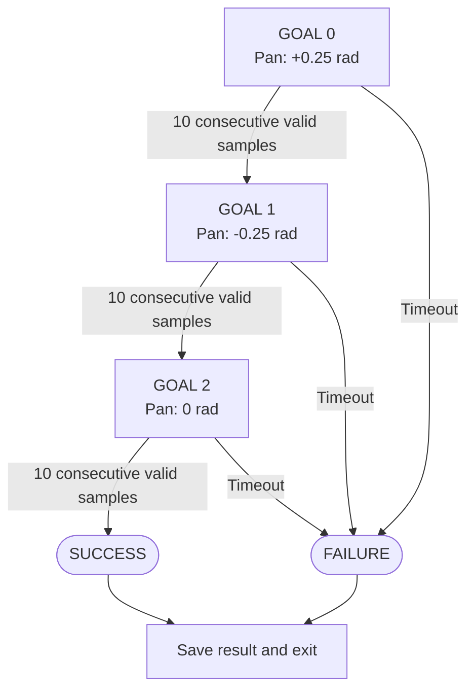

# Tracking goals using measured state

This experiment gives the actual SO-101 asset a small complete task: move the pan joint through `+0.25 → −0.25 → 0` rad, keeping other references at zero. Each transition depends on simulation measurements. API completion and physical goal completion become distinct.

This is a **joint-space task**, not visual cube detection or grasping. It teaches measurement, timeouts and a state machine for later manipulation.

## 1. Run

```bash
.venv/bin/python examples/09_so101_waypoints.py
```

Outputs are `outputs/waypoints/trajectory.csv` and `metrics.json`. If the directory exists, choose `--output outputs/waypoints-02`. Initial asset download needs internet; this example normally does not render images.

For a Mac desktop window:

```bash
.venv/bin/mjpython examples/09_so101_waypoints.py \
  --viewer --output outputs/waypoints-viewer
```

A Linux desktop can use normal Python. Viewer mode adds wall-clock pacing without changing goals/substeps. This example's validated run is windowless; the [separate viewer test](../basla/dogrulama.md) established local window operation.

## 2. Define success first

| Setting | Value | Interpretation |
|---|---|---|
| Control rate | 50 Hz | One command per 20 ms simulated time |
| Physics timestep | 0.002 s | Model setting |
| Substeps | 10 | Exactly 0.020 s, no ratio rounding |
| Command slew | 0.5 rad/s | At most 0.01 rad reference change per decision |
| Error tolerance | 0.04 rad | About 2.29° for every joint |
| Consecutive valid samples | 10 | One crossing is insufficient |
| Timeout | 8 s per goal | Unreachable goals do not loop forever |

This is a chosen task acceptance criterion, not a hardware accuracy specification. Ten consecutive samples cover ten control steps; their first/last timestamps are 0.18 s apart. No separate velocity threshold is imposed, so success is not proof of complete rest.

## 3. Four different values

```text
goal     = final reference for the current stage
command  = intermediate reference sent on this step
q_before = position measured before the command
q_after  = position measured after physics advances
```

The servo tries to track command, but dynamics, friction, gravity and contact can leave error. Testing only `command==goal` would not establish that the arm caught up.

The reference is slew-limited from the previous reference:

```python
command = previous_command + clip(goal - previous_command, -0.01, 0.01)
```

This limits the commanded reference, not the measured joint velocity. A physical speed limit needs additional measured behavior and constraints. Do not directly transfer this simulation setting as a hardware safety parameter.

## 4. What Strands does

```python
keys = sim.robot_action_keys("so101")
result = sim.send_action(
    dict(zip(keys, command)), robot_name="so101", n_substeps=10,
)
```

The method writes actuator targets and advances the requested substeps. Calling `step(10)` afterward would double that duration. Use actuator keys because joints and actuators need not correspond one-to-one on other robots. [MuJoCo backend source](https://github.com/strands-labs/robots/blob/82be6e684314c20a2778c4927f63f2d737795b43/strands_robots/simulation/mujoco/simulation.py)

The inspected asset uses keys `"1"` through `"6"`. The script checks that mapping instead of guessing. Controls for this asset are radians, unlike the normalized hardware recipe.

## 5. State machine



At every target, an error outside tolerance resets the consecutive-valid counter. The other five reference values stay at zero.

All three stages must complete. A failure prevents later stages, saves the unsuccessful outcome and returns a nonzero exit code.

## 6. Measured result

The local run completed **3/3 goals in 121 control steps, 2.42 simulated seconds**:

| Goal | Stage duration | Final maximum joint error |
|---|---|---|
| +0.25 rad pan | 0.64 s | 0.032430 rad |
| −0.25 rad pan | 1.14 s | 0.031886 rad |
| Return to zero | 0.64 s | 0.031680 rad |

Maximum error includes all six joints, not only pan. Find the contributing joint in the CSV before blaming gravity or servo settings. Simulated duration is distinct from wall-clock duration; FPS metadata does not prove real-time execution.

## 7. Read it as data

The CSV contains pre-state, command, post-state, goal, stage and times. `q_before` is the decision-time measurement; `command` is its sent label. Treating `q_after` as a preceding observation shifts the timeline.

To imitate this controller, current q alone may be insufficient: different stages can require opposite movements from the same position. Include goal/stage; exact reference-slew imitation may require previous command/history. This illustrates task conditioning and memory.

The CSV is not a LeRobot image dataset. It has no camera features or complete recording schema, and three fixed pan goals do not teach visual grasping.

## 8. Extend toward manipulation

| Stage | Observation | Transition evidence |
|---|---|---|
| Approach above object | Object/tip pose | Tip error within threshold |
| Descend | Tip/table distance | Grasping height reached |
| Close | Jaw opening, available contacts | Expected closure/contact |
| Lift | Object world height | Object lifted and following |
| Carry | Object/tip position | Placement region reached |
| Release and retreat | Object region and stability | Placement independent of gripper |

A closed jaw is not proof of a grasp. Verify object motion and final placement. Appropriate tip frames, SO-101 orientation limits and collision handling require further work; this table is not a validated grasp implementation.

## 9. Experiments

Run `--timeout 0.1 --output outputs/waypoints-timeout` and expect failure plus saved CSV/JSON. In a copy, lower tolerance to 0.01 and examine whether it merely prevents transitions: changing acceptance criteria does not improve physics. Reorder goals and compare total time. Finally design a transition requiring both low error and low measured speed, with explicit units and thresholds.
