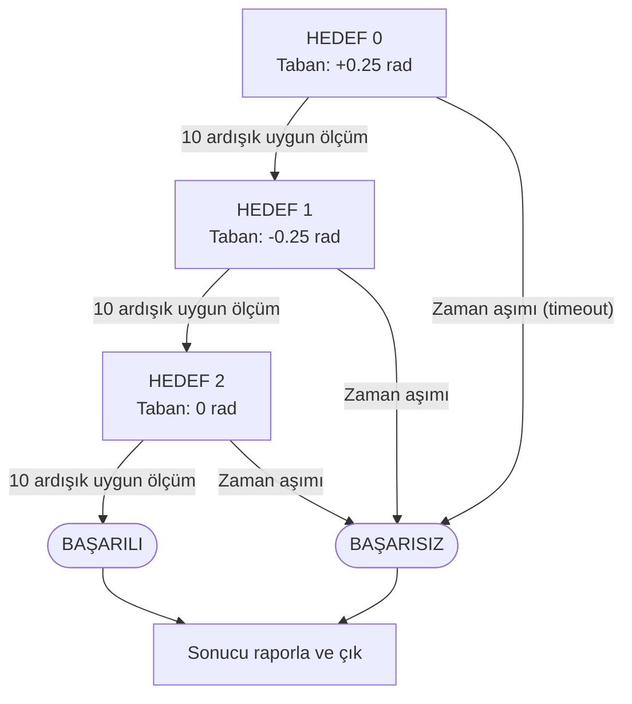

# Ölçülen durumla hedef takibi

Bu deneyde SO-101 modeli için küçük, tamamlanabilir bir görev kuruyoruz: taban dönme eklemini `+0.25 → −0.25 → 0` radyan hedeflerine götürmek, diğer eklem (joint) referanslarını sıfırda tutmak. Her geçiş gerçek simülasyon (simulation) ölçümüne bağlı. Böylece “API başarılı döndü” ile “hedefe ulaşıldı” arasındaki farkı deneyle görürsün.

Bu bir **eklem uzayı görevi**. Görüntüden küp bulma veya kavrama denetleyicisi içermez. Sonraki manipülasyon görevinde kullanacağın ölçüm, zaman aşımı (timeout) ve durum (state) makinesi iskeletini öğretir.

## 1. Çalıştır

Proje kökünde, kurulu sim ortamıyla:

```bash
.venv/bin/python examples/09_so101_waypoints.py
```

`outputs/waypoints/trajectory.csv` ve `metrics.json` oluşur. Çıktı klasörü zaten varsa script üzerine yazmaz; `--output outputs/waypoints-02` seç. İlk robot varlığı indirmesinde internet gerekir. Bu deney kamera görüntü üretimi (render) etmediği için normal çalışmada görüntü üretimi gerekmez.

Masaüstü penceresiyle izlemek için macOS:

```bash
.venv/bin/mjpython examples/09_so101_waypoints.py \
  --viewer --output outputs/waypoints-viewer
```

Linux masaüstünde aynı seçenekle normal Python kullanılabilir. `--viewer` duvar saatiyle pacing ekler; fizik açısından hedefler ve alt adımlar aynıdır. Bu genişletmede doğrulanan koşu penceresiz çalıştırmadır; önceki [ayrı viewer deneyi](../basla/dogrulama.md) yerel pencereyi doğrular.

## 2. Başarı sözleşmesini önce yaz

| Parametre | Seçim | Neden? |
|---|---|---|
| Kontrol hızı | 50 Hz | Her 20 ms sim zamanında bir komut |
| Fizik adımı | 0.002 s | Modelin bu koşudaki değeri |
| Alt adım | 10 | 10 × 0.002 = 0.020 s; yuvarlama yok |
| Referans değişim sınırı | 0.5 rad/s | Komut bir kontrol adımında en çok 0.01 rad değişir |
| Hata toleransı | 0.04 rad | Bütün altı eklemde yaklaşık 2.29° sınırı |
| Ardışık uygun ölçüm | 10 | Tek örneklik hedef geçişi yeterli sayılmaz |
| Zaman aşımı | Hedef başına 8 s | Ulaşılamayan hedef sonsuz döngü üretmez |

Bu tolerans bir donanım hassasiyet iddiası değildir. Görev için önceden seçilmiş kabul ölçütüdür. On ardışık 50 Hz gözlem (observation), on kontrol adımını kapsar; ilk ve son uygun ölçüm arasındaki zaman 0.18 s'dir. Ayrı bir hız (velocity) eşiği kontrol edilmediği için bu koşul “mutlak olarak durdu” kanıtı da değildir.

## 3. Dört ayrı sayı

```text
goal       = bu aşamada ulaşmak istediğim son hedef
command    = bu adımda servoya gönderdiğim ara referans
q_before   = komuttan önce ölçülen konum
q_after    = fizik ilerledikten sonra ölçülen konum
```

Pozisyon servosu ara referansı takip etmeye çalışır. Dinamikler, sürtünme (friction), yerçekimi (gravity) ve temas (contact) nedeniyle ölçülen konum referansla aynı olmak zorunda değildir. Bir sonraki aşamaya geçişi `command == goal` ile kontrol etseydik robotun yetişip yetişmediğini öğrenemezdik.

Kodda komut, önceki komut üzerinden sınırlandırılır:

```python
command = previous_command + clip(goal - previous_command, -0.01, 0.01)
```

Bu **referansın** değişim sınırıdır; robotun gerçek hızına sert limit koymaz. Gerçek hızı da sınırlamak istiyorsan ölçülen hızları, aktüatör (actuator) davranışını ve ayrı denetim koşullarını incelemelisin. Bu değer fiziksel SO-101'e doğrudan taşınacak güvenlik parametresi değildir.

## 4. Strands çağrısı tam olarak ne yapıyor?

```python
keys = sim.robot_action_keys("so101")
result = sim.send_action(
    dict(zip(keys, command)),
    robot_name="so101",
    n_substeps=10,
)
```

Bu sürümde `send_action` aktüatör hedeflerini yazar ve verilen sayıda fizik adımı ilerletir. Sonra ayrıca `sim.step(10)` çağırırsan planladığın sürenin iki katını ilerletirsin. Anahtarları aktüatör arayüzünden alırız; farklı robotlarda eklem adı ile aktüatör adı aynı olmayabilir. [Strands MuJoCo uygulaması](https://github.com/strands-labs/robots/blob/82be6e684314c20a2778c4927f63f2d737795b43/strands_robots/simulation/mujoco/simulation.py)

İncelenen SO-101 varlığı `"1"`–`"6"` anahtarlarını kullanıyor. Script bu eşlemeyi açık kontrol eder; başka varlık düzeninde tahmin ederek devam etmez. Bu varlıktaki hedefler radyandır. LeRobot donanım tarifimizdeki normalize eylemleri buraya aynen kopyalama.

## 5. Durum makinesi



Her hedefte, en büyük eklem hatası toleransı aşarsa ardışık uygun ölçüm sayacı sıfırlanır. Hedefler arasında diğer beş referans sıfırda kalır.

Başarıda üç aşama tamamlanmalıdır. Bir aşama başarısız olursa sonraki hedeflere geçilmez. Rapor başarısızlığı saklar ve program sıfır olmayan çıkış kodu verir; otomatik deney toplayıcısı bu farkı kullanabilir.

## 6. Gerçek çalıştırma sonucu

8 Eylül 2026'da bu çalışma alanındaki varlıkla **121 kontrol adımı, 2.42 sim saniyesi, 3/3 hedef** tamamlandı:

| Hedef | Aşama süresi | Son en büyük eklem hatası |
|---|---|---|
| +0.25 rad taban | 0.64 s | 0.032430 rad |
| −0.25 rad taban | 1.14 s | 0.031886 rad |
| Sıfıra dönüş | 0.64 s | 0.031680 rad |

En büyük hata bütün altı eklem üzerinden hesaplanır; yalnız taban hatası değildir. Sonucun sıfırdan farklı kalmasının hangi eklemden geldiğini CSV'den bul. Yerçekimi veya servo ayarı neden olabilir diye hipotez kurabilirsin; tek sayıdan nedeni kanıtlamış sayma.

Sim saniyesi, programın duvar saatinde kaç saniye sürdüğü değildir. Penceresiz fizik daha hızlı çalışabilir. Veri kaydındaki FPS de her zaman işlemin gerçek zamanlı çalıştığını kanıtlamaz.

## 7. CSV'den bir eğitim örneği okumak

Bir satırda `q_before_1..6`, `command_1..6`, `q_after_1..6`, hedef, aşama ve zamanlar var. Zaman eşlemesinde `q_before` karar öncesi durum, `command` gönderilen etikettir. `q_after` sonraki durumdur; onu geçmiş gözlemmiş gibi eşlemek zaman kayması yaratır.

Bu denetleyiciyi öğrenmek için yalnız `q_before` yeterli olmayabilir: aynı konumdan farklı aşamalarda sağa veya sola gitmek gerekir. Hedef/aşama bilgisi de gözleme katılmalı; referans değişim sınırını tam taklit etmek için önceki komut gibi geçmiş bilgisi gerekebilir. Bu, neden bir politikanın görev koşulu veya geçmiş gözlem kullandığına küçük bir örnektir.

Bu CSV bir LeRobot veri kümesi (dataset) değildir; görüntü, görev metni ve kayıt şeması yoktur. Üç sabit eklem hedefi de görsel kavrama uzmanı üretmez. Görüntülü uzman veri hattına geçerken hem görev denetleyicisi hem gözlem/eylem (action) kaydı eklenir.

## 8. Küp kavrama denetleyicisine ilerlemek

Eklem hedefi geçişlerinin yerine şu aşamalar gelir:

| Aşama | Gerekli gözlem | Geçiş ölçütü |
|---|---|---|
| Nesnenin üstüne yaklaş | Nesne konumu, uç konumu | Uç konum hatası uygun |
| Alçal | Uç/masa mesafesi, nesne pozu | Kavrama yüksekliğine ulaşma |
| Kapat | Parmak açıklığı, mümkünse temas | Beklenen kapanış ve temas koşulu |
| Kaldır | Nesnenin dünya yüksekliği | Nesne masadan ayrıldı ve takip ediyor |
| Taşı | Nesne/uç konumu | Bırakma bölgesine erişme |
| Bırak ve uzaklaş | Nesnenin bölge/masa durumu | Tutucudan bağımsız yerleşme |

Kapanmış tutucu (gripper) tek başına nesne kavrama kanıtı değildir. Nesne yüksekliği ve bırakma sonrası konumu gibi dış ölçütler gerekir. IK için uygun uç kare (frame)'i, SO-101'in yönelim kısıtları ve çarpışmalar ayrıca çözülür. Bu tablo tasarım tarifidir; burada çalıştırılmış tam kavrama uygulaması olarak sunulmaz.

## 9. Deneyler

**Zaman aşımı:** `--timeout 0.1 --output outputs/waypoints-timeout` çalıştır. İlk hedefe yetişmeden başarısız rapor beklenir. CSV yine oluşmalı.

**Tolerans:** kodun bir kopyasında toleransı 0.01'e indir. Daha küçük değer gerçekten daha iyi takip mi sağlıyor, yoksa yalnız geçişi engelliyor mu? Denetleyiciyi değiştirmeden kabul sınırını küçültmek fiziksel hatayı azaltmaz.

**Hedef sırası:** mevcut üç hedefin sırasını değiştir, toplam süreyi karşılaştır. Aynı nihai hedefin farklı başlangıç durumundan farklı sürebildiğini göster.

**Geçiş ölçütü:** bir aşamada yalnız son hata yerine hata ve düşük ölçülen hız koşulu tasarla. Önce hangi birim ve eşiklerle test edeceğini yaz; ardından sonucu eski metrikle karşılaştır.
