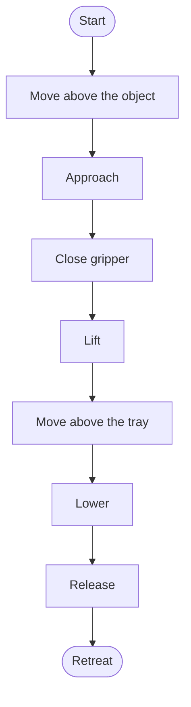

# Scene, camera and motion

Start with a fixed arm base, level floor, one object and one or two cameras. Keep visual and physical definitions consistent so changes remain interpretable.

## Place an object

```python
sim.add_object(
    name="cube", shape="box",
    size=[0.02, 0.02, 0.02],
    position=[0.22, 0.08, 0.025],
    color=[1.0, 0.4, 0.2, 1.0], mass=0.03,
)
```

Box sizes are half-sizes, giving about 4 cm edges. Putting its center at z=0 can bury it in the floor, causing the contact solver to correct a large overlap with unexpected motion. Dynamic objects fall; fixtures such as a table need an appropriate static definition. Changing table height also changes the relevant base/object/camera coordinates.

## Add a camera

```python
sim.add_camera(
    name="front", position=[0.65, -0.65, 0.50],
    target=[0.05, 0.0, 0.18], width=640, height=480,
)
```

Camera names become dataset keys, so use stable names such as front/wrist. This call defines a fixed world camera; naming it wrist does not attach it to the moving wrist. A real wrist camera needs a body attachment or explicit pose updates.

Use `sim.list_cameras()` to inspect names. Two names for one view are not two independent viewpoints. [Strands scene API](https://strands-labs.github.io/robots/simulation/overview/)

## Do not guess action order

`send_action` applies actuator controls and advances physics substeps. `set_joint_positions` changes configuration kinematically. These do not produce equivalent demonstrations.

A six-element vector does not establish correct order, units or actuator meaning. Inspect `robot_action_keys("so101")` and `get_robot_state` first. Check your installed signature:

```bash
.venv/bin/python -c 'import inspect; from strands_robots.simulation import Simulation; print(inspect.signature(Simulation.send_action))'
```

Begin with small changes near current targets. Understand limits, ctrlrange, gripper direction and initial state before moving an internet action sequence onto hardware.

## Design a grasping state machine



Give each transition an observed condition. A hundred elapsed steps does not prove a grasp. Inspect object height, motion relative to the gripper and contacts. Placement should require the object to remain in the target region after release, not merely the script reaching its last line.

A scripted expert needs verified target poses, IK, limits, collision handling and contact behavior. The mock recorder does not implement that expert. This is a development exercise, not a claimed ready-made successful grasp controller. Start with the [measured joint state machine](denetleyici.md).

## Keep a scene record

Save object mass/size, friction, base pose, camera pose/FOV, resolution, control frequency, seed and asset version. A repeated seed across different physics versions or thread arrangements does not ensure bitwise equality. See [camera geometry](../donanim/kamera-kalibrasyonu.md) for calibration details.
