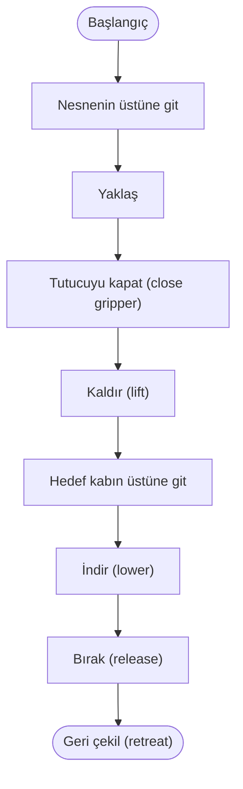

# Sahne, kamera ve hareket

Bir sahnenin hem fiziksel hem görsel tanımı tutarlı olmalı. İlk sahneyi sade tut: sabit kol tabanı, düz zemin, tek nesne, bir ya da iki kamera. Bir parçayı değiştirdiğinde sonucun hangi değişiklikten geldiğini takip edebilirsin.

## Nesne yerleştirme

```python
sim.add_object(
    name="cube",
    shape="box",
    size=[0.02, 0.02, 0.02],
    position=[0.22, 0.08, 0.025],
    color=[1.0, 0.4, 0.2, 1.0],
    mass=0.03,
)
```

Bu boyutlar kutu geometrisinin yarı boyutları olarak yorumlanır; amaç yaklaşık 4 cm kenarlı nesnedir. Merkez yüksekliğini sıfıra koymak nesneyi zemine gömebilir. Başlangıçta temas (contact) çözücüsünün büyük bir iç içe geçmeyi düzeltmesi, beklenmedik fırlama veya titreşim üretebilir.

Dinamik nesneye yerçekimi (gravity) etki eder; masa/kap gibi sabit tutulacak nesnelerde statik seçim gerekir. Masa yüksekliği değişirse robot tabanı, nesne konumu ve kamera hedefinin de aynı dünya çerçevesine göre güncellenmesi gerekir.

## Kamera kur

```python
sim.add_camera(
    name="front",
    position=[0.65, -0.65, 0.50],
    target=[0.05, 0.0, 0.18],
    width=640,
    height=480,
)
```

Kamera adı veri setinde bir anahtara dönüşeceği için rastgele değiştirme. `front`, `wrist` gibi işlev anlatan adlar seç. Yukarıdaki `add_camera` dünya koordinatında sabit bir kameradır; adına `wrist` demek onu hareketli bileğe bağlamaz. Bilek kamerası için model gövdesine gerçek bağlama veya poz güncelleyen açık bir kurulum gerekir.

`sim.list_cameras()` ile kullanılabilir adları öğren. Aynı görüşü farklı isimlerle kaydedip “iki kamera” sanma. Görüş çeşitliliği sayısal kanal sayısından farklıdır. [Strands kamera ve nesne API'si](https://strands-labs.github.io/robots/simulation/overview/)

## Eylem gönderirken sırayı tahmin etme

`sim.send_action(...)` aktüatör (actuator) hedeflerini uygulayıp fizik alt adımlarını ilerletir. `sim.set_joint_positions(...)` ise kinematik konum yazma yoludur. İkisi eğitim (training) gösterimi bakımından eşdeğer değildir.

Bir eylem (action) vektörünün altı elemanlı olması, doğru altı motoru doğru sırada temsil ettiğini göstermez. Önce `robot_action_keys("so101")` ile mevcut aktüatör sözleşmesini, `get_robot_state` ile durum (state) isimlerini incele. Kullanılan sürümdeki metot imzasını şu şekilde görebilirsin:

```bash
.venv/bin/python -c 'import inspect; from strands_robots.simulation import Simulation; print(inspect.signature(Simulation.send_action))'
```

Pozisyon hedefi verme denemesinde önce mevcut hedefe yakın küçük bir değişiklik ve kısa süre kullan. Modelin limitleri, `ctrlrange`, gripper yönü ve başlangıç state'ini bilmeden internetten alınmış bir action dizisini gerçek kola taşıma.

## Bir kavrama gösterimi nasıl tasarlanır?

Bir görev durum makinesi düşün:



Her geçişin koşulu olmalı. “100 adım geçti” tek başına tutucunun nesneyi tuttuğunu göstermez. Simde nesnenin yükselmesi, tutucuya göre göreli hareketi ve temas bilgileri incelenebilir. Kaba bırakmada nesnenin kap bölgesinde belirli süre kalması gerekir. Başarıyı script'in son satıra ulaşmasıyla ölçme.

Gerçek bir scripted uzman oluşturmak için hedef pozlarını, IK'yi, eklem (joint) limitlerini, çarpışmaları ve tutucu (gripper)/nesne temasını doğrulaman gerekir. Bu rehberin mock kayıt scripti bu kavrama uzmanını uygulamaz. Bu bölümdeki durum makinesi, uzman denetleyici (controller) geliştirme ödevidir; hazır başarılı pick-and-place kodu olarak sunulmaz.

## Sahne defteri

Her veri toplamada nesne kütlesi/boyutu, sürtünme (friction), taban pozu, kamera pozu/FOV, çözünürlük, kontrol frekansı ve random rastgelelik tohumu (seed)'i kaydet. `seed` aynı olsa bile farklı fizik sürümü/asset/iş parçacığı ayarıyla bit düzeyinde aynı sonucu varsayma. Aynı sahneyi yeniden kurabilmek için parametreler ve varlık sürümü gerekir.
