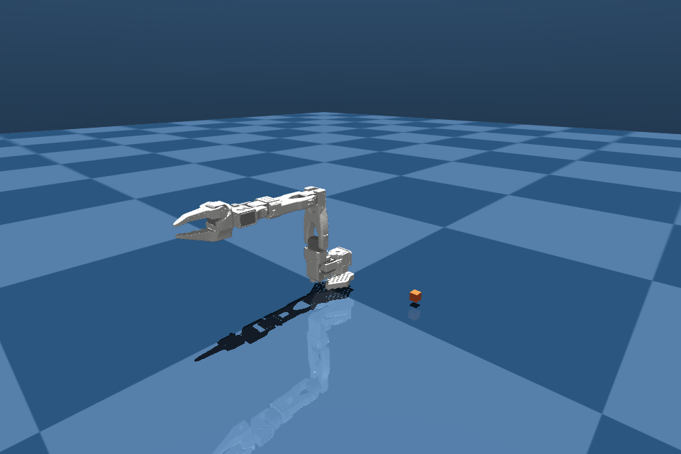

# SO-101 with Strands Robots

This chapter directly uses the [strands-labs/robots](https://github.com/strands-labs/robots) project you supplied. Executable recipes target `strands-robots==0.5.1`; a new parameter on GitHub main is not necessarily in that package.

## Your first program

The complete example is `examples/02_strands_so101.py`:

```python
from strands_robots import Robot

sim = Robot("so101", mode="sim", mesh=False)
try:
    result = sim.get_robot_state("so101")
    print(result)
finally:
    sim.cleanup()
```

`Robot` is a factory: this call already prepares the world and robot. Do not immediately call `create_world()` again. With the lower-level `Simulation()` constructor you create the world/add the robot yourself. Keep these two entry points distinct.

`mode="sim"` explicitly selects simulation. `mesh=False` disables fleet networking for the exercise. Hardware uses `mode="real"` and a serial port in another chapter.

## Run

```bash
.venv/bin/python examples/02_strands_so101.py --render --steps 30
```

The script loads SO-101, adds a cube and front camera, reads initial state, runs 30 mock control steps, and saves `outputs/so101_before.png` and `outputs/so101_after.png`.

On a Mac desktop, view about 30 seconds of motion with:

```bash
.venv/bin/mjpython examples/02_strands_so101.py --viewer --steps 900
```

Use normal Python on a Linux desktop. This is the native MuJoCo viewer; move its camera with the mouse. Motion still comes from the mock policy. `Ctrl+C` stops the script; a local display session is required.



The image was produced by this script using the [SO-ARM100 asset repository](https://github.com/TheRobotStudio/SO-ARM100), Strands and robot_descriptions. It is not a calibrated material/dynamics replica of your supplier's kit.

## Check the returned status

Many tools return dictionaries with `status` and `content`. A call returning without an exception can still contain an error. The examples' `checked(...)` helper rejects those results.

```python
result = sim.get_robot_state("so101")
if result["status"] != "success":
    raise RuntimeError(result)
```

Human-readable messages can be in text blocks; machine fields can be in JSON blocks. Record the joint keys: the inspected asset exposes `1`–`6`. Do not assume those are the physical LeRobot names.

## What does mock prove?

It can show asset loading, policy calls, resolved action keys, physics stepping and rendering. It does not prove object recognition, grasp planning, contact or learning. Writing a grasp instruction does not turn mock into an expert. API success and task success need different criteria.

## Make changes

Change cube color and expect the image to change, not a color-aware mock decision. Move the camera and consider how much the model input changes. Run `--steps 60` and inspect state/time. Render without stepping and verify that drawing is not an action.

After the first asset download, repeated loading normally uses the local `.cache/` directories. Robot assets and later VLA weights are separate downloads. For a task with measured completion, continue to [target tracking](denetleyici.md). [Strands simulation reference](https://strands-labs.github.io/robots/simulation/overview/)
