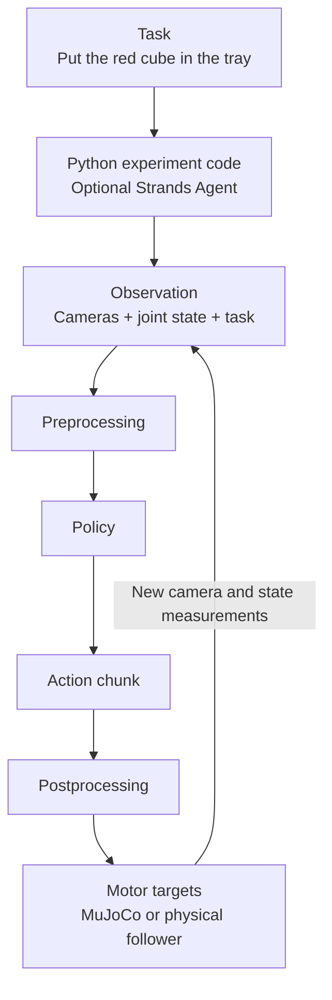

# The software map

These tools solve different parts of the problem. They are connected, but one does not automatically perform every other's job.

| Layer | Responsibility | Workshop component |
|---|---|---|
| Physics | Evolve bodies, joints and contacts | MuJoCo |
| Robot/tools | Load a robot, inspect state, command and record | Strands Robots |
| Hardware/data | Drivers, teleoperation, dataset and training infrastructure | LeRobot |
| Learned behavior | Produce actions from observations/tasks | ACT, SmolVLA |
| High-level agent | Interpret a request and select tools | Strands Agents, optional |
| Reading interface | Searchable bilingual guide | MkDocs Material |

The physics/control loop repeatedly reads observations and sends actions. The training loop reads saved examples, calculates a loss and updates model weights. An optimizer step does not send a motor command to your physical arm.

## Data flow

During demonstration collection, a human and leader supply targets. During training, saved observation/action pairs update model weights.

## What Strands simplifies

`Robot("so101", mode="sim")` is a factory that prepares a simulation world and robot. Hardware mode and policy providers live in the same library. Its tools can be exposed to an agent without asking a chat model to close the physics loop at every step. [Strands Robots](https://github.com/strands-labs/robots)

MuJoCo does not itself recognize objects or train policies. Installing Strands does not make pretrained SmolVLA successful on your desk. LeRobot records more than video: observations must remain associated with actions.

## When does an LLM provider matter?

The direct Python simulation exercises do not call a language model. With `Agent(...)`, the chosen provider's account, model access and usage rules apply. An LLM API key belongs to that layer; it is not required for MuJoCo physics. See [agent integration](../ogrenme/ajan.md).

## What can wait?

ROS 2, fleet networking, cloud deployment, large-scale RL and photorealistic simulation can be added when needed. Your first SO-101 teleop/record/train loop depends more directly on camera schema, action units and demonstration quality.
