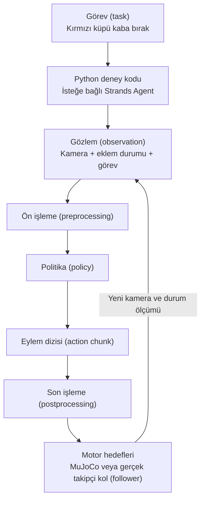

# Yazılım haritası

Bu projede her katmanın bir sorumluluğu var. Katmanları ayırmak, “model bozuk” diye düşündüğün bir sorunun aslında kamera ismi uyuşmazlığı olduğunu fark etmeni sağlar.

| Bileşen | Rol | İlk alıştırmada gerekli mi? |
|---|---|---|
| MuJoCo | Eklem (joint), temas (contact), yerçekimi (gravity) ve görüntü üretimi | Evet, sim için |
| Robot modeli (MJCF/mesh) | Kolun geometri, eklem, kütle (mass) ve aktüatör (actuator) tanımı | SO-101 sim için |
| Strands Robots | Sim/hardware/politika (policy) işlemlerini Python ve ajan araçlarıyla sunma | SO-101 Strands alıştırmasında |
| Strands Agent + dil modeli | Doğal dil isteğini araç çağrılarına çevirme | İsteğe bağlı ileri aşama |
| LeRobot | Robot/teleop, veri kümesi (dataset), eğitim (training) ve politika yürütümü (rollout) altyapısı | Veri ve öğrenme aşamasında |
| ACT / SmolVLA | Gözlemden eylem (action) üreten öğrenilmiş politika | Eğitim sonrası |
| Hugging Face Hub | Model ve veri deposu | İndirme/paylaşma gerektiğinde |
| MkDocs | Bu rehberi okunabilir siteye dönüştürme | Okuma için |

## Veri yolu

Gösterim (demonstration) toplarken politika yerine insan + leader hedef üretir. Eğitimde ise kaydedilmiş gözlem (observation) ve eylem çiftleri kullanılır. Eğitim süreci her eniyileyici (optimizer) adımında gerçek kola motor komutu göndermez.

## Strands neyi kolaylaştırıyor?

`Robot("so101", mode="sim")` bir simülasyon (simulation) örneği oluşturur. Dünyayı ve robotu fabrika fonksiyonu hazırlar. Aynı kitaplıkta hardware modu ve policy sağlayıcıları bulunur. Uygulama kodunu agent araçları olarak kullanabilirsin; bunun için fizik kontrol döngüsünü her adımda bir sohbet modeline emanet etmen gerekmez. [Strands Robots](https://github.com/strands-labs/robots)

MuJoCo tek başına nesneleri anlamaz ve robotu eğitmez. Strands kurulması da SmolVLA ağırlıklarını otomatik olarak senin masanda başarılı hâle getirmez. LeRobot kayıt biçimi ise videodan fazlasını içerir: hangi gözleme hangi eylemin karşılık geldiğini taşımalıdır.

## LLM ücreti ne zaman devreye girer?

Rehberdeki doğrudan Python sim örnekleri dil modeli çağrısı yapmaz. `Agent(...)` kullandığında seçilen sağlayıcının hesabı, erişimi, model kimliği ve kullanım koşulları gerekir. Bir API anahtarı sadece LLM katmanına aittir; MuJoCo fizik hesabının çalışması için gerekli değildir.

## Önce neyi öğrenmeyebilirsin?

ROS 2, filo ağı, bulut dağıtımı, yüksek ölçekli RL ve fotogerçekçi sim araçları daha sonra eklenebilir. Tek SO-101'in ilk teleop/kayıt/eğitim hattında bunları kurmak zorunda değilsin. İlk projede kamera şeması, eylem birimleri ve gösterim kalitesi daha doğrudan etki eder.
